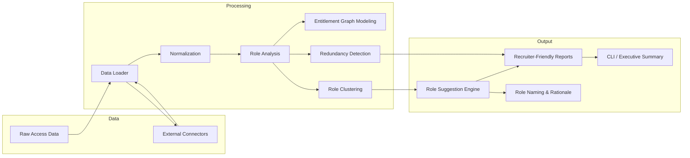

# Architecture Design

## Vision

A reusable IAM analytics platform that turns raw entitlement assignments into business-aligned role definitions and governance insight.

## Domain model

- `User` represents an identity in the enterprise
- `Application` represents an IAM-connected system
- `Entitlement` represents a permission or access right
- `Role` represents a curated grouping of entitlements for business use

## Component boundaries

- `data_loader.py`: ingestion and normalization of raw IAM access data
- `role_analysis.py`: entitlement graph modeling, redundancy detection, and clustering
- `role_suggestions.py`: human-centered recommendations and naming guidance
- `pipeline.py`: orchestrates the end-to-end flow and keeps responsibilities separate
- `cli.py`: easy entry points for analysis, recommendation, and summary reporting

## Architectural motivations

- **Separation of concerns**: each package owns a single aspect of the workflow
- **Explainability first**: outputs are expressed as role clusters and rationale, not opaque predictions
- **Enterprise-ready mindset**: the code is structured so a real IAM team can replace sample data with external connectors, add risk scoring, and integrate into governance pipelines

## Architecture diagram

## Extension pathways

- add connectors for Snowflake, Azure AD, Okta, SailPoint, or CSV extracts
- expand the graph model for role hierarchies and inheritance
- introduce policy-based risk scoring and certification workflows
- support multi-tenant and cloud-native governance platforms
